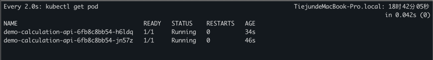

# Real-Time Balance Calculation System

1. **Objective**:
    - Develop a real-time balance calculation system in Java and deploy it on a Kubernetes (K8s) cluster in cloud platforms (AWS/GCP/Ali), ensuring high availability and resilience requirements are met.
2. **Requirements**:
    - **Core Functionality**:
        - Implement a service that processes financial transactions and updates account balances in real-time.
        - Each transaction should include a unique transaction ID, source account number, target account number, amount, and timestamp, and the service should handle concurrent transactions and update balances accordingly.
    - **High Availability and Resilience**:
        - Deploy the service on a Kubernetes cluster (e.g., AWS EKS, GCP GKE, Alibaba ACK).
        - Use Kubernetes features like Deployments, Services, and Horizontal Pod Autoscaler (HPA) to ensure high availability and scalability.
        - Implement retry mechanisms for failed transactions.
        - Use managed database services (e.g., AWS RDS, GCP Cloud SQL, Alibaba RDS) to store account and transaction data, ensuring data consistency and integrity through database transactions and locks.
    - **Performance**:
        - Optimize the service to handle high-frequency transactions.
        - Implement caching using distributed cache services (e.g., AWS ElastiCache, GCP Memorystore, Alibaba Cloud ApsaraDB for Redis).
    - **Testing**:
        - Write unit tests using JUnit.
        - Create integration tests to ensure proper service interaction with database and cache.
        - Conduct resilience tests to ensure service recovery from failures (e.g., pod restarts, node failures).
        - Perform performance testing using load testing tools (e.g., Apache JMeter).
    - **Mocking Data**:
        - Use mock data generators to simulate large volumes of transactions and account balances for testing purposes.
3. **Documentation**:
    - Provide a README file with service deployment and testing instructions.
    - Include architecture diagrams and explanations of design choices.
4. **Deliverables**:
    - Source code repository (e.g., GitHub).
    - Kubernetes deployment manifests or Helm charts.
    - Test coverage reports.
    - Resilience test results.
    - Performance test results.
    - Documentation.

# Project Documentation

## Project Structure

```
calculation-core Core business logic
calculation-api External interfaces
calculation-domain Business object definitions
calculation-e2e Integration tests
scripts Load testing scripts, elastic scaling test scripts
```

## Architecture Diagram


## Quick Start

- Start Redis
```
docker-compose service redis up -d
```
- Start MySQL
```
docker-compose service mysql up -d
```
- Start the project
```
mvn spring-boot:run
```
- Run performance tests

If running locally, modify the test plan to adjust the API endpoints to local addresses

```
jmeter -n -t scripts/load-test-plan.jmx -l scripts/load-test-result.jtl
```

- Run unit tests
```
mvn test
```

- Helm installation
```
helm install calculation-core ./charts/calculation-core
```

- Use [testkube](https://testkube.io/blog/jmeter-and-kubernetes-how-to-run-tests-efficiently-with-testkube) to run load tests

```
kubeclt apply -f scripts/load-test.yaml
testkube run testworkflow jmeter
```

# Code Coverage Report


# Horizontal Scaling Test Report

To make it easier to trigger horizontal scaling conditions, CPU threshold is adjusted to 8%;


After running load test to trigger scaling:




# Performance Test Report

## Test Resources

CPU: 500m
Memory: 1280Mi

## Test Results


