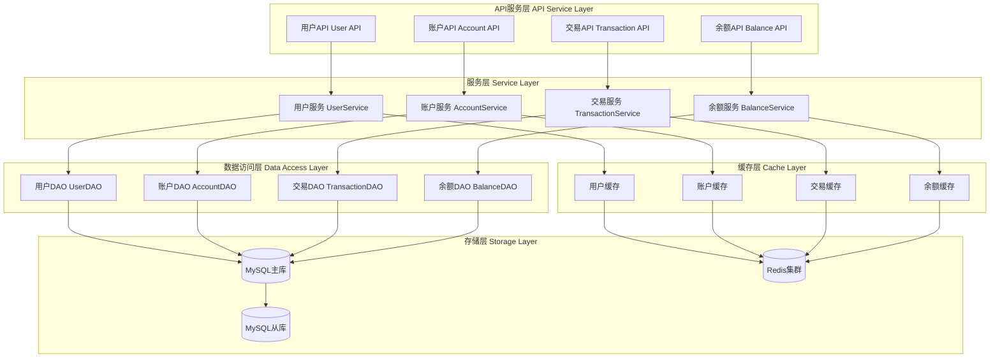

# 项目文档

## 项目结构

```
calculation-core 核心业务逻辑
calculation-api 对外提供接口
calculation-domain 业务对象定义
calculation-e2e 集成测试
```

## 架构图


## 快速开始

1. 启动redis
```
docker-compose service redis up -d
```
2. 启动mysql
```
docker-compose service mysql up -d
```
3. 启动项目
```
mvn spring-boot:run
```
4. 执行性能测试

```
jmeter -n -t scripts/load-test-plan.jmx -l scripts/load-test-result.jtl
```
5. 执行单元测试
```
mvn test
```
6. Helm 安装
```
helm install calculation-core ./charts/calculation-core
```


# 代码覆盖率报告


# 弹性测试报告


# 性能测试报告


