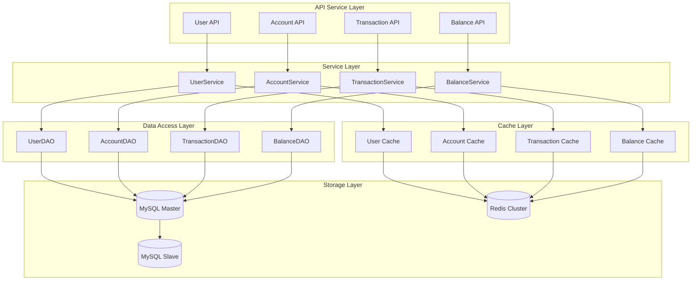
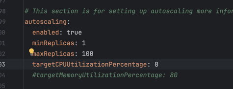
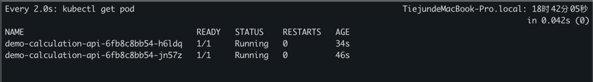
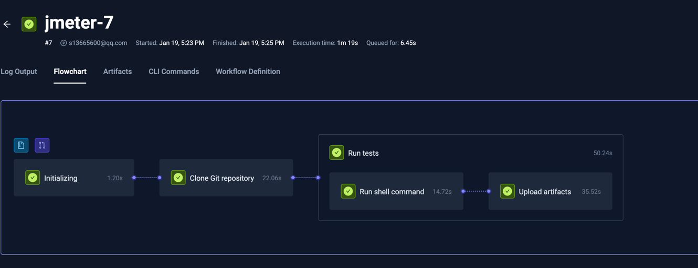
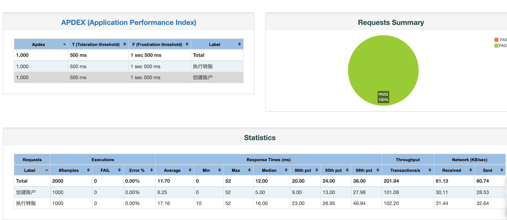

# Project Documentation

## Project Structure

```
calculation-core Core business logic
calculation-api External interfaces
calculation-domain Business object definitions
calculation-e2e Integration tests
scripts Load testing scripts, elastic scaling test scripts
```

## Architecture Diagram


## Quick Start

- Start Redis
```
docker-compose service redis up -d
```
- Start MySQL
```
docker-compose service mysql up -d
```
- Start the project
```
mvn spring-boot:run
```
- Run performance tests

If running locally, modify the test plan to adjust the API endpoints to local addresses

```
jmeter -n -t scripts/load-test-plan.jmx -l scripts/load-test-result.jtl
```

- Run unit tests
```
mvn test
```

- Helm installation
```
helm install calculation-core ./charts/calculation-core
```

- Use [testkube](https://testkube.io/blog/jmeter-and-kubernetes-how-to-run-tests-efficiently-with-testkube) to run load tests

```
kubeclt apply -f scripts/load-test.yaml
testkube run testworkflow jmeter
```

# Code Coverage Report


# Horizontal Scaling Test Report

To make it easier to trigger horizontal scaling conditions, CPU threshold is adjusted to 8%;



After running load test to trigger scaling:




# Performance Test Report

## Test Resources

CPU: 500m
Memory: 1280Mi

## Test Results





