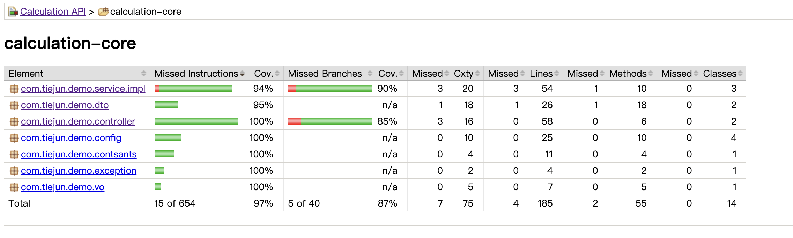

# 项目文档

## 项目结构

```
calculation-core 核心业务逻辑
calculation-api 对外提供接口
calculation-domain 业务对象定义
calculation-e2e 集成测试

```

## 快速开始

1. 启动redis
```
docker-compose service redis up -d

```
2. 启动mysql
```
docker-compose service mysql up -d
```
3. 启动项目
```
mvn spring-boot:run

```


# 代码覆盖率报告



# 弹性测试报告


# 性能测试报告


